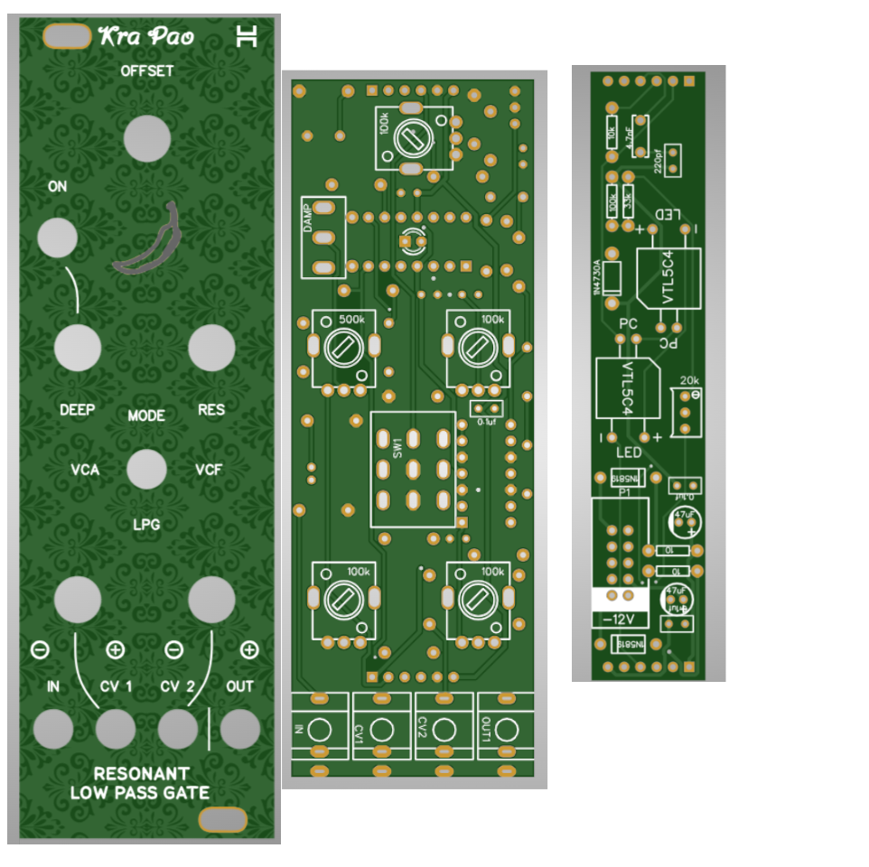

# Voxmachina Krapao Resonant Low Pass Gate - now in 8HP
This repository contains the files for a narrower version of the great 
[Krapao low pass gate](https://www.youtube.com/watch?v=gdqPUZgIWGM&t=87s) module from voxmachina.

I would say my version is more of a bootleg/edit more than actually changing much here.

## Status: confirmed working!

## Hardware and ordering
The repo has three gerbers, one is the panel, one is the control pcb, one is the "main pcb" which basically 
only contains the vactrols. Just order one of each at a pcb service of your choice (I use jlcpcb.com).

BOM is the same as original krapao, I have a csv file but it'S not very tidy. All pots are R09k type (I make the holes
bigger because the chinese knock offs have bigger legs) all jacks are thonkiconn.

Instead of ordering VTL5C3 vactrols (which are expensive) I would recommend making your own using
a simple LED, some shrink tubing and an LDR. There are a ton of tutorials out there just google DIY vactrol.

## Build
Since the build is a bit crammy on 8hp there are a few places where you have to think about what order you solder things in.
Most notably the LED in the front that is on the backside of a TL074. Nothing horrible, just take it slow.

Earlier versions had the problem of things on the control pcb and the vactrol pcb sticking out and being in the
way of each other. This should be resolved by now.

